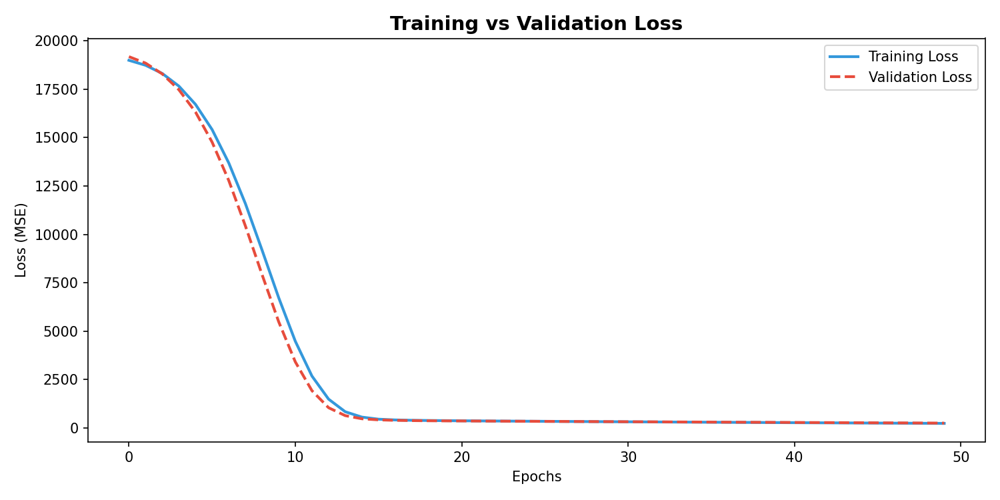
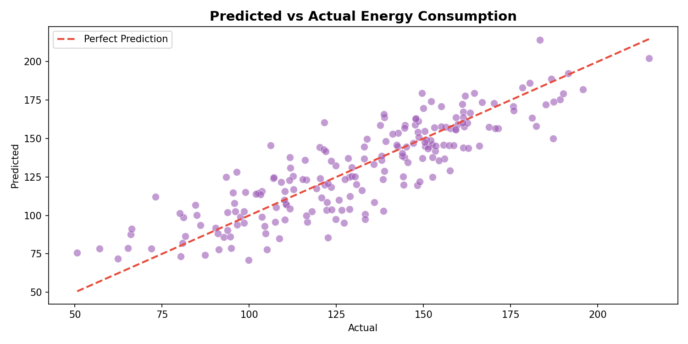
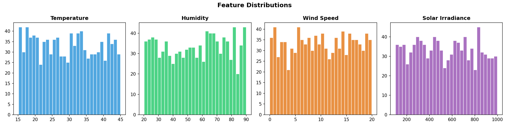

# Energy Consumption Prediction — Feedforward Neural Network

A feedforward neural network built with TensorFlow/Keras to predict
energy consumption from environmental sensor data.

## Model Architecture
Input (4 features) → Dense(64, ReLU) → Dense(32, ReLU) → Dense(1)

## Visualizations

### Training vs Validation Loss

### Predicted vs Actual Energy Consumption

### Feature Distributions

## Key Findings
- Model converges cleanly with no overfitting across 50 epochs
- Validation loss closely tracks training loss
- Predictions cluster near the perfect prediction line
- StandardScaler normalisation was critical for stable training

## Libraries Used
TensorFlow/Keras · scikit-learn · pandas · numpy · matplotlib
